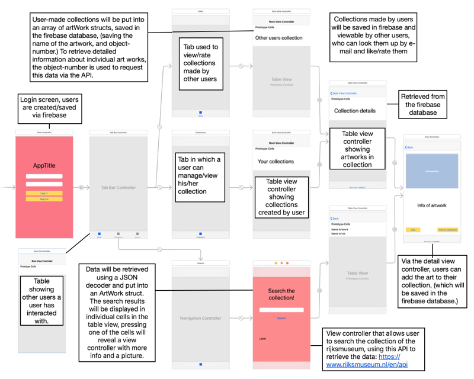
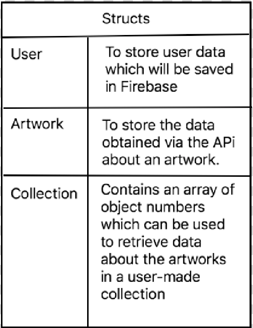

# Frameworks

The rijksmuseum API will be used to obtain data about artworks. Link to API info: http://rijksmuseum.github.io/
To save user accounts an data (their self-made collections) Firebase will be used.

Since the rijksmuseum API offers a lot of information per artwork, it wouldn't be practical to use all this data in a mobile app, so the only data that will be saved in the Artwork struct is:
- The picture (as a URL)
- Name
- Name Artist
- Description

These are the structs that will be used to save the data in:

Within Firebase, user-made collections will be saved under the users e-mail adress, which is how other users can look them up.

A user-made collection will contain an array of artworks along with their object number which can be used to quickly obtain more information about the artwork via the API. 
