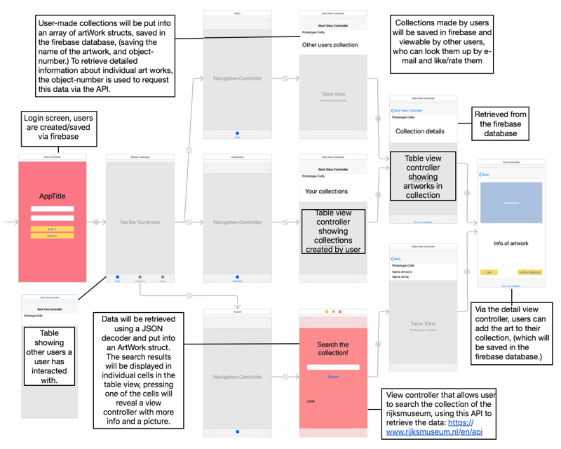

# MuseumApp

## Problem statement

The Rijksmuseum is the first among the top museums in the world to have almost their entire collection available online, inlcuding high definition images. For many art and history fans, being able to access this collection on their phones and tablets in the form of a user-friendly app would be a very welcome addition to their lives. Since the Rijksmuseum collection is so large, the app allows users to make their own collections as well as look at and rate the collections made by other users.

## Solution

An app which allows users to create accounts and look through the art collection of the Rijksmuseum and gives them the possibility to make their own collections as well as look at collections made by other users.

Main features:

- Search through the rijksmuseum collection being able to see detailed information and pictures of the art.
- Users can create their own "collections" (for instance their top 10 favourite paintings of fruit or best portraits of the 17th century)
- These collection can be looked up and seen by other users, who can favourite them.
- Users can see a list of recent users they have interacted with.

Optional:

- Users can rate other user's their collections.
- Users can update their profile to have a profile picture and some personal info (which can be viewed by other users when they look at their collections.

## Prerequisites

This app will use the Rijksmuseum API found here: https://www.rijksmuseum.nl/nl/api

For user accounts and saving the collections Firebase will be used.

The rijksmuseum website has a similar concept (called Rijks Studio) which also allows for the creation of collections by users which can then be viewed by other users, but this website is optimized for Computers. This app will try to offer a similar experience but optimized for a smartphone.

The hardest part will be implementing a way for users to access, interact and share collections with other users, and properly saving this into a database. 

